# Deep learning workshop

### Types of AI

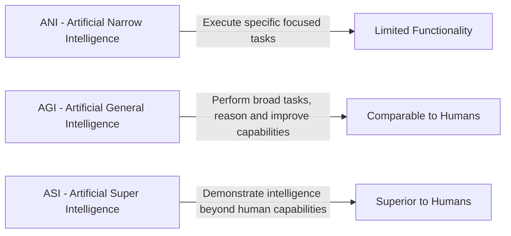

### ANI Evolution

- Engineering making programs and intelligent machines [1990 - 1970]
- Ability to learn without being programmed [1980 - 2006]
- Learning based on Deep neural networks [1980 - 2020]

### ML

Machine learning is a field which gives computer the ability to learn without being explicitly programmed.

### ML Types:

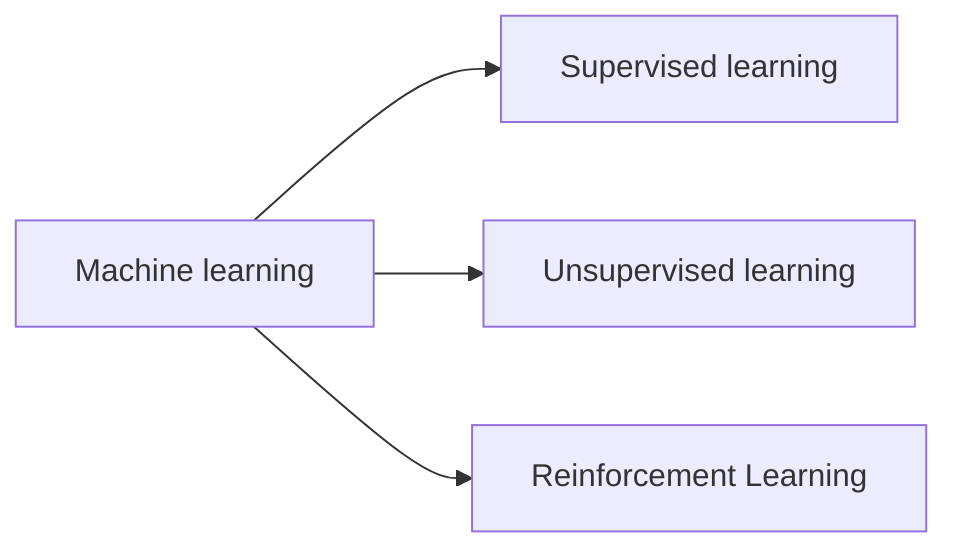

#### Unsupervised learning:

- Clustering, dimensionality reduction

#### Supervised learning:

- Classification, Regression

#### Reinforcement learning:

- Game AI, learning tasks, Real time decisions, Skills acquisition

> NOTE

```
Clustering – process of grouping data, it’s a technique.
Dimensionality reduction.

```

### Traditional programming vs supervised learning

#### traditional programming

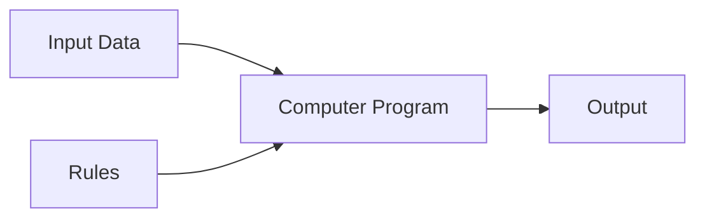

#### Supervised learning

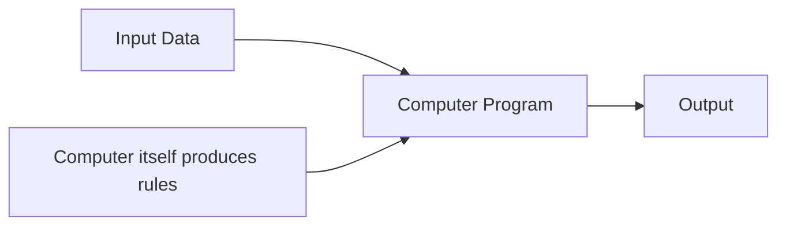

### Types of data

1.  Structured Data
    - Relational data, a table, follows a structure.
2.  Unstructured Data
    - Scrambelled images, videos etc...
3.  Semi structured Data
    - Html, XML, etc..

### Process of ML Applications

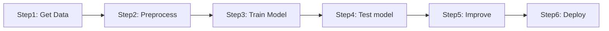

### Classification of KNN

example:

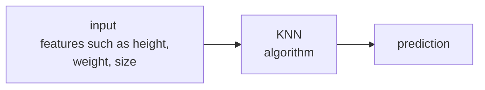

##### 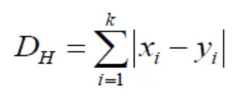

#### _steps involved in KNN_

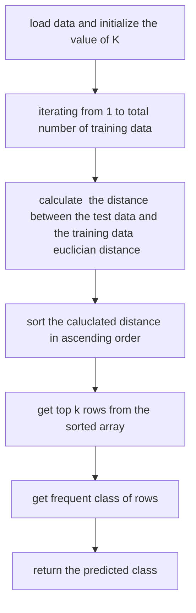

### Decision Tree classifier

- Its a type of supervised learning algo. that is mostly used for classification problems.
- it works on both categorical and continuous dependent variables
- In this algo we split hte population into two types

#### Example of iris flower dataset:

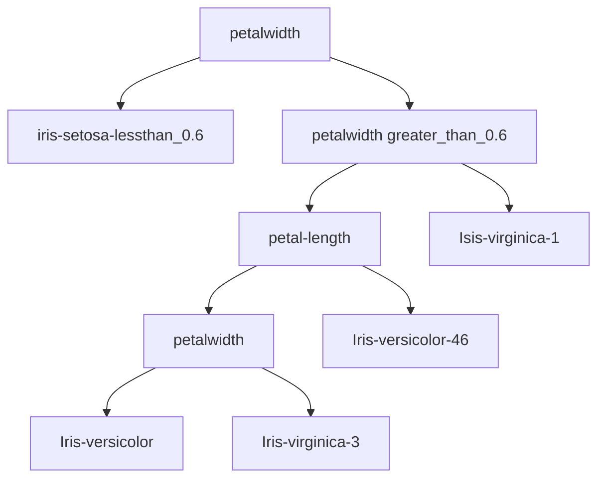

### performance measures

- A confusion matrix is a table used to describe the performance f=of the classification model or `("classifier")` on a set of test data for which the true values are know.

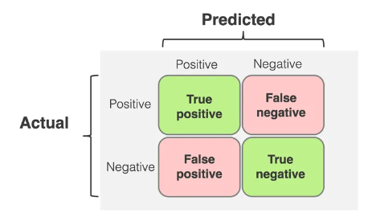

1. Performance meausres

```
Accuracy = No. of samples predicted correctly / total number of samples
```

2. Precision

```
precision = TP / (TP + FP)
```

3. Recall

```
Recall = TP / (TP + FN)
```

4. Specificity

```
Specifity = TN / (TN + FP)
```

5. F1 SCORE

```
F1 score = 2 * (precision * recall) / (precision + recall)
```

#### Overfitting and underfitting

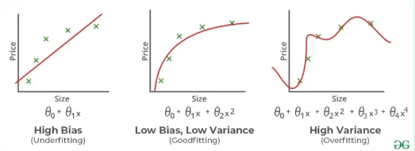

   <hr/>

### Neural Newtwork

> An artificial neural network(ANN) is a computational model that is inspired by the way biological neural networks in human brain process information.
> <br/><br/>It tries to mimic the behaviour of human brain.

#### Basics of ANN

- Neural networks are typically organised in `layers`.
- Layers are made up of number of interconnected `nodes` which contain `activation function`.
- The inout layer communicates with the external enviorment that presents a pattern to neural network.

> 1. In ANN the input layer consists of numebr of neurons which are equal to the numebr of neurons.<br/><br/>
> 2. In the output layer the number of neurons is equal to the number of classes in the classification problem.

_Lets consider the iris dataset for eg:_

- Input layer have `4` neurons.
- Output layer have `3` layers.

### Tyeps of neural network:

1. **Feed forward networks**

- Single layer
- Multi layer

2. **Feedback networks**
3. **Recurrent neural networks**
4. **Convolutional neural network**

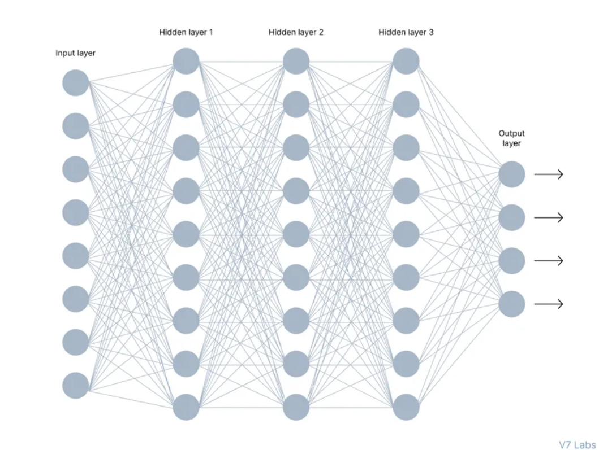

### Recurrent networks:

- they are designed to recognize patterns in sequences of data.

### Convolutional neural network:

- it deals with image data. it shares the weight among neurons using convolutional network.
- it is used in image classification, object detection, image segmentation.

### Actiation function:

- Activation function also called as transfer funciton is used to map input nodes to output nodes in certain fashion.
- Identify linear activation function
- F(x) = X

**1. Binary step function**
$$f(x) = \begin{cases} 0 & \text{if } x < 0 \\ 1 & \text{if } x \geq 0 \end{cases}$$

**2. Logistic or sigmoid function**
$$f(x) = \frac{1}{1 + e^{-x}}$$

**3. Tanh**
$$f(x) = \frac{e^x - e^{-x}}{e^x + e^{-x}}$$

**4. ReLU (Rectified Linear Unit)**
$$f(x) = max(0, x)$$

**5. Leaky ReLU**
f(x) = max(ax, x), where x is the input to the neuron, and a is a small constant, typically set to a value like 0.01. This means that when the input x is negative, the output will be ax instead of 0, allowing a small amount of the input to pass through.

**6. Softmax**
f(x_i) = e^(x_i) / ∑(j=1 to n) e^(x_j) where x_i is the i^th element of the input vector, and n is the total number of elements in the input vector.

### How neural networks work

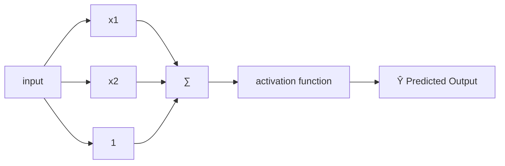

Bias = `Ŷ = (b+∑(i=1 to n) x^i *w^i)`

`epoch` describes about number of times the model is trained on the training data.

### preception working

| x1  | x2  | y   |
| --- | --- | --- |
| 158 | 58  | 1   |
| 158 | 59  | 1   |
| 160 | 64  | 0   |
| 163 | 64  | 0   |
| 165 | 61  | 0   |

sample calculation:

```
w1 = 0.4
w2 = 0.5
b = 0.1
θ = 96

yin1 = 153 * 0.4 + 58*0.5 + 0.1
     = 92.3

```

### Perception learning algorithm

P - ipnut with label 1
N - ipnut with label 0
initialize `w` randomly

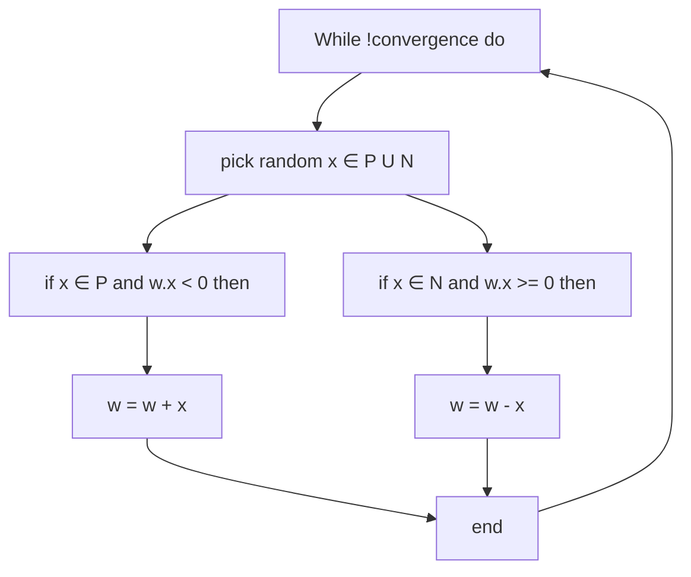

<hr/>

### ML vs DL

#### Machine learning

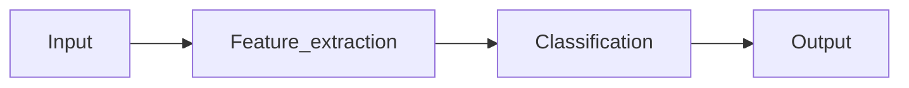

#### Deep learning

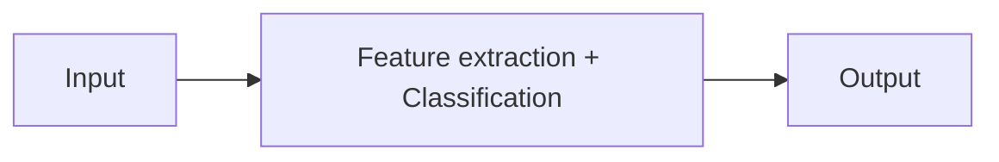

<br/>
<br/>

1. Back propogration is the `learning algorithm` used in Deeplearning algorithm.
2. Back propogration is used to `update the weights` of the model.

<hr/>
<br/><br/>

> Day 2 of workshop [17/08/2024]

### Recap of excersise

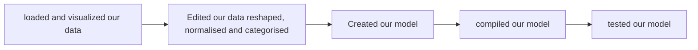

<br/>

> Notes

1. Faltten the data. eg: converting a matrix into a array.
2. Converting into an Linear. eg: Transfer of data from one layer to all the neurons in another layer. It reprents a dense funciton. `In liner we are converting the 784 neurons into 512 layer of neurons`.
3. In deep neural network, there should be atleast one hidden layer.

_Lossly function_ - `To identify the difference the actual output and expected output`

_Step_ - `Step is used to describe about the weight change/value.`

```
MSE is the error value, but we are square rooting it coz, the error can be negative or positive (RMSE).
```

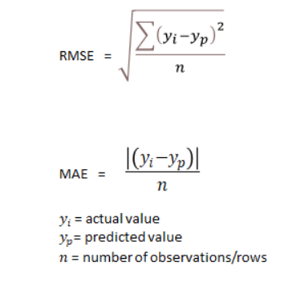

1. `Bianry classification` is used when there is two classification.
2. `Cross classification` is used there are many classification.

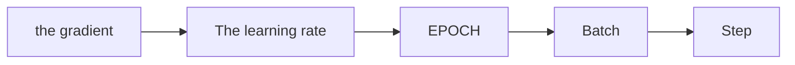

**Other than finding error in each record. we can consider applying the weight on the batch to find the error and try rectifying the error by manipulating the weight.**

### Optimizers

---

example of some optimizers:

1. Adam
2. Adagrad
3. RMSprop
4. SGD

_Optimizer plays a vital role it is to fine tune a mode, updating weights, managing learning weight and to improve accuraccy._

#### Training vs validation data

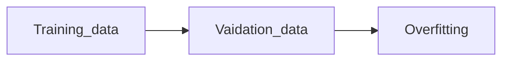

#### Kernels and convolution

---

**kernels are also called as filters some of the filters are:**

1. Blur kernel.
2. Brightness kernel.
3. Sharpen kernel.
4. Darken kernel.

eg:
Blur kernal:
||||
|---|---|---|
|0.6|0.13|0.6|
|0.13|0.25|0.13|
|0.6|0.13|0.6|

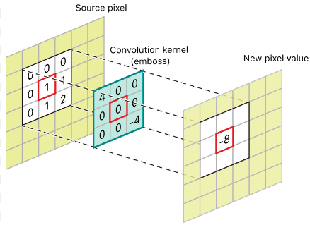

**_For working with CNN we should know the types of kernels(filters) available for model creation._**

> Stride

stride value is used in the multiplication of the kernels in the image. it deals with the matrixes.

**Example of stride usage:**
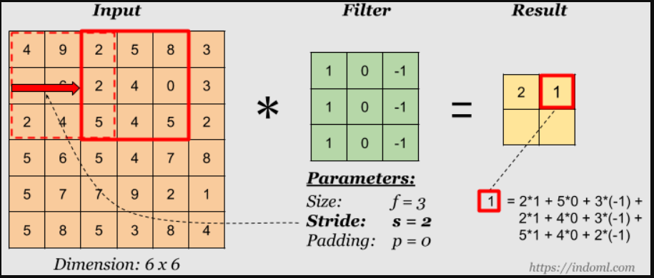

> padding

padding is used to add the zeros in the image to make the image size same as the kernel size.

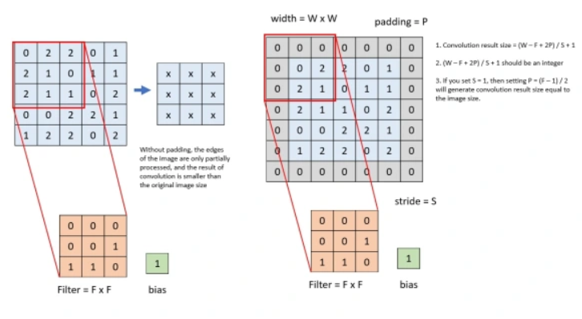

_advantages of padding_

1. The corner information is considered only once normally. to include the corner information also we use padding.
2. The make the output size is same as the input size.

### Kernels and neural networks

---

If the image have a color channel thus the kernel also must have a color channel.

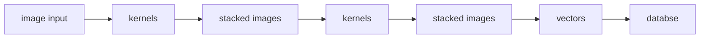

<br/>

**Max pooling:**
It the data is too large and if i want to consider only the important features.
eg:
Lets consider a 6X6 matrix which can be seperated into 2x2 into 4 times. and the maximum value can be foundut to make a new matirx.

**Dropout:**
It means we are turning off some neurons. it is used to prevent overfitting.
It is used to generalize the neurons performance.

example: If you have given a mcq you can atlest choose the answer. if you are given a fill in the blacks you need to use your own knowledge u learnt to answer the question.

**Convolutional neural network flow :**
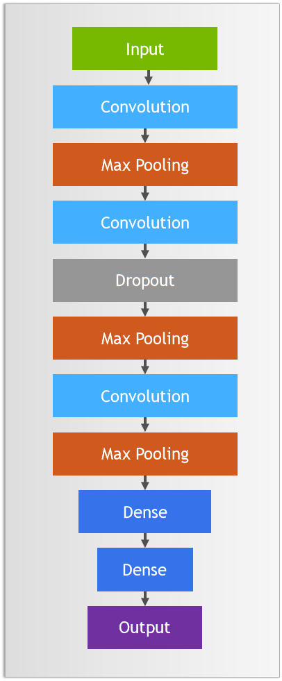

**CNN model creation**

```
model = nn.Sequential(
    # First convolution
    nn.Conv2d(IMG_CHS, 25, kernel_size, stride=1, padding=1),  # 25 x 28 x 28
    nn.BatchNorm2d(25),
    nn.ReLU(),
    nn.MaxPool2d(2, stride=2),  # 25 x 14 x 14
    # Second convolution
    nn.Conv2d(25, 50, kernel_size, stride=1, padding=1),  # 50 x 14 x 14
    nn.BatchNorm2d(50),
    nn.ReLU(),
    nn.Dropout(.2),
    nn.MaxPool2d(2, stride=2),  # 50 x 7 x 7
    # Third convolution
    nn.Conv2d(50, 75, kernel_size, stride=1, padding=1),  # 75 x 7 x 7
    nn.BatchNorm2d(75),
    nn.ReLU(),
    nn.MaxPool2d(2, stride=2),  # 75 x 3 x 3
    # Flatten to Dense
    nn.Flatten(),
    nn.Linear(flattened_img_size, 512),
    nn.Dropout(.3),
    nn.ReLU(),
    nn.Linear(512, n_classes)
)
```

<br/>
<br/>

**Conv2D:** These are our 2D convolutional layers. Small kernels will go over the input image and detect features that are important for classification. Earlier convolutions in the model will detect simple features such as lines. Later convolutions will detect more complex features. Let's look at our first Conv2D layer:
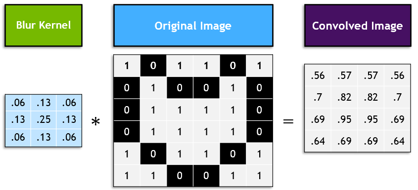
nn.Conv2d(IMG_CHS, 25, kernel_size, stride=1, padding=1)
25 refers to the number of filters that will be learned. Even though kernel_size = 3, PyTorch will assume we want 3 x 3 filters. Stride refer to the step size that the filter will take as it passes over the image. Padding refers to whether the output image that's created from the filter will match the size of the input image.

**Batch normalization:** Like normalizing our inputs, batch normalization scales the values in the hidden layers to improve training. Read more about it in detail here.

There is a debate on best where to put the batch normalization layer. This Stack Overflow post compiles many perspectives.

**Maxpolling2D:**
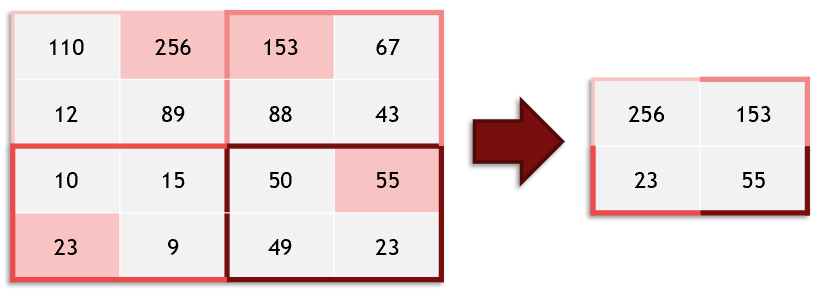
Max pooling takes an image and essentially shrinks it to a lower resolution. It does this to help the model be robust to translation (objects moving side to side), and also makes our model faster.

**Dropout:**
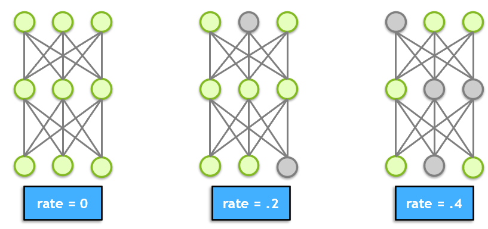
Dropout is a technique for preventing overfitting. Dropout randomly selects a subset of neurons and turns them off, so that they do not participate in forward or backward propagation in that particular pass. This helps to make sure that the network is robust and redundant, and does not rely on any one area to come up with answers.

**Faltten:** Flatten takes the output of one layer which is multidimensional, and flattens it into a one-dimensional array. The output is called a feature vector and will be connected to the final classification layer.

**Linear:** We have seen dense linear layers before in our earlier models. Our first dense layer (512 units) takes the feature vector as input and learns which features will contribute to a particular classification. The second dense layer (24 units) is the final classification layer that outputs our prediction.

**Image manipulation:**
1. Horizontal Flipping
2. Vertical Flipping
3. Zooming
4. Homography
5. Brightness
6. Sharpness
7. Resize
8. Grayscale
9. Rotation

