# Deep learning workshop

### Types of AI

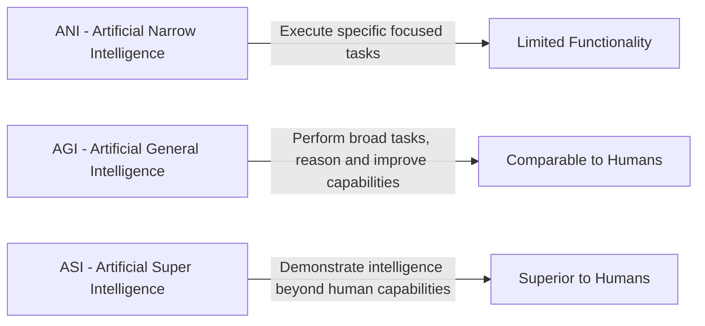

### ANI Evolution

- Engineering making programs and intelligent machines [1990 - 1970]
- Ability to learn without being programmed [1980 - 2006]
- Learning based on Deep neural networks [1980 - 2020]

### ML

Machine learning is a field which gives computer the ability to learn without being explicitly programmed.

### ML Types:

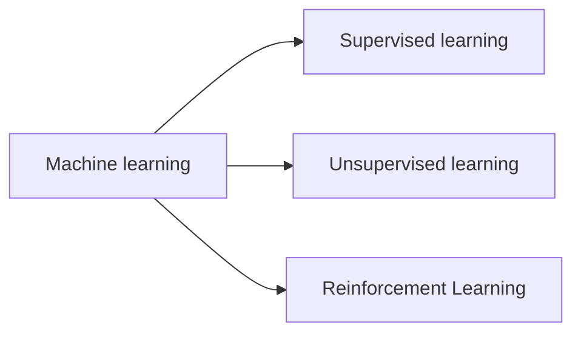

#### Unsupervised learning:

- Clustering, dimensionality reduction

#### Supervised learning:

- Classification, Regression

#### Reinforcement learning:

- Game AI, learning tasks, Real time decisions, Skills acquisition

> NOTE

```
Clustering – process of grouping data, it’s a technique.
Dimensionality reduction.

```

### Traditional programming vs supervised learning

#### traditional programming

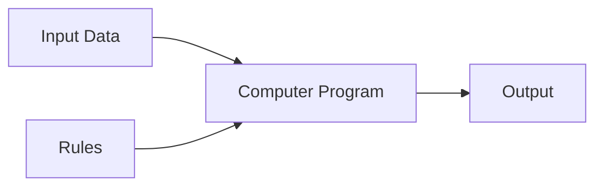

#### Supervised learning

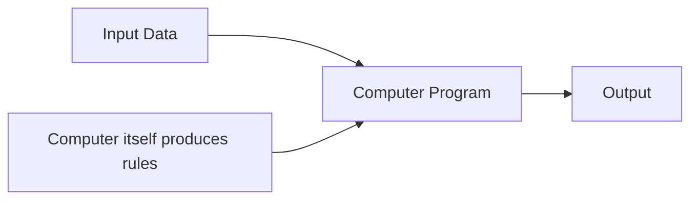

### Types of data

1.  Structured Data
    - Relational data, a table, follows a structure.
2.  Unstructured Data
    - Scrambelled images, videos etc...
3.  Semi structured Data
    - Html, XML, etc..

### Process of ML Applications

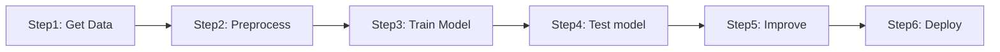

### Classification of KNN

example:

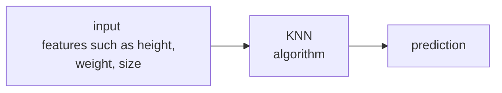

##### 

#### _steps involved in KNN_

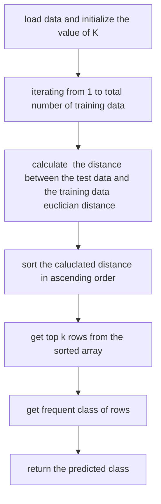

### Decision Tree classifier

- Its a type of supervised learning algo. that is mostly used for classification problems.
- it works on both categorical and continuous dependent variables
- In this algo we split hte population into two types

#### Example of iris flower dataset:

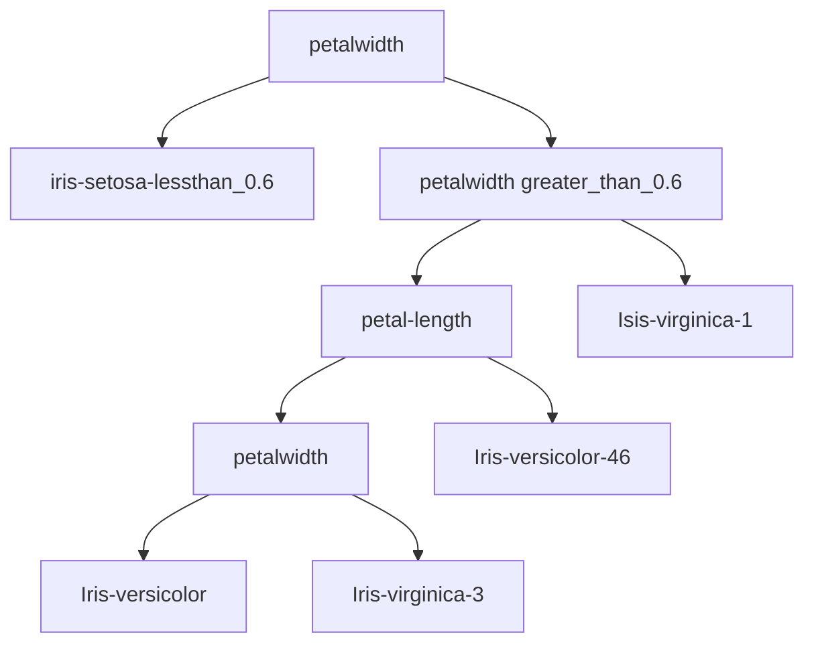

### performance measures

- A confusion matrix is a table used to describe the performance f=of the classification model or `("classifier")` on a set of test data for which the true values are know.


1. Performance meausres

```
Accuracy = No. of samples predicted correctly / total number of samples
```

2. Precision

```
precision = TP / (TP + FP)
```

3. Recall

```
Recall = TP / (TP + FN)
```

4. Specificity

```
Specifity = TN / (TN + FP)
```

5. F1 SCORE

```
F1 score = 2 * (precision * recall) / (precision + recall)
```

#### Overfitting and underfitting


   <hr/>

### Neural Newtwork

> An artificial neural network(ANN) is a computational model that is inspired by the way biological neural networks in human brain process information.
> <br/><br/>It tries to mimic the behaviour of human brain.

#### Basics of ANN

- Neural networks are typically organised in `layers`.
- Layers are made up of number of interconnected `nodes` which contain `activation function`.
- The inout layer communicates with the external enviorment that presents a pattern to neural network.

> 1. In ANN the input layer consists of numebr of neurons which are equal to the numebr of neurons.<br/><br/>
> 2. In the output layer the number of neurons is equal to the number of classes in the classification problem.

_Lets consider the iris dataset for eg:_

- Input layer have `4` neurons.
- Output layer have `3` layers.

### Tyeps of neural network:

1. **Feed forward networks**

- Single layer
- Multi layer

2. **Feedback networks**
3. **Recurrent neural networks**
4. **Convolutional neural network**


### Recurrent networks:

- they are designed to recognize patterns in sequences of data.

### Convolutional neural network:

- it deals with image data. it shares the weight among neurons using convolutional network.
- it is used in image classification, object detection, image segmentation.

### Actiation function:

- Activation function also called as transfer funciton is used to map input nodes to output nodes in certain fashion.
- Identify linear activation function
- F(x) = X

**1. Binary step function**
$$f(x) = \begin{cases} 0 & \text{if } x < 0 \\ 1 & \text{if } x \geq 0 \end{cases}$$

**2. Logistic or sigmoid function**
$$f(x) = \frac{1}{1 + e^{-x}}$$

**3. Tanh**
$$f(x) = \frac{e^x - e^{-x}}{e^x + e^{-x}}$$

**4. ReLU (Rectified Linear Unit)**
$$f(x) = max(0, x)$$

**5. Leaky ReLU**
f(x) = max(ax, x), where x is the input to the neuron, and a is a small constant, typically set to a value like 0.01. This means that when the input x is negative, the output will be ax instead of 0, allowing a small amount of the input to pass through.

**6. Softmax**
f(x_i) = e^(x_i) / ∑(j=1 to n) e^(x_j) where x_i is the i^th element of the input vector, and n is the total number of elements in the input vector.

### How neural networks work

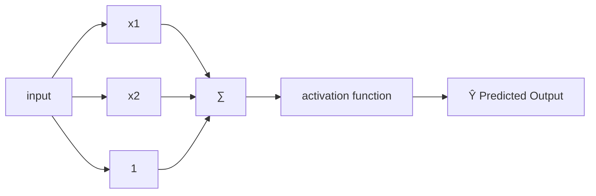

Bias = `Ŷ = (b+∑(i=1 to n) x^i *w^i)`

`epoch` describes about number of times the model is trained on the training data.

### preception working

| x1  | x2  | y   |
| --- | --- | --- |
| 158 | 58  | 1   |
| 158 | 59  | 1   |
| 160 | 64  | 0   |
| 163 | 64  | 0   |
| 165 | 61  | 0   |

sample calculation:

```
w1 = 0.4
w2 = 0.5
b = 0.1
θ = 96

yin1 = 153 * 0.4 + 58*0.5 + 0.1
     = 92.3

```

### Perception learning algorithm

P - ipnut with label 1
N - ipnut with label 0
initialize `w` randomly

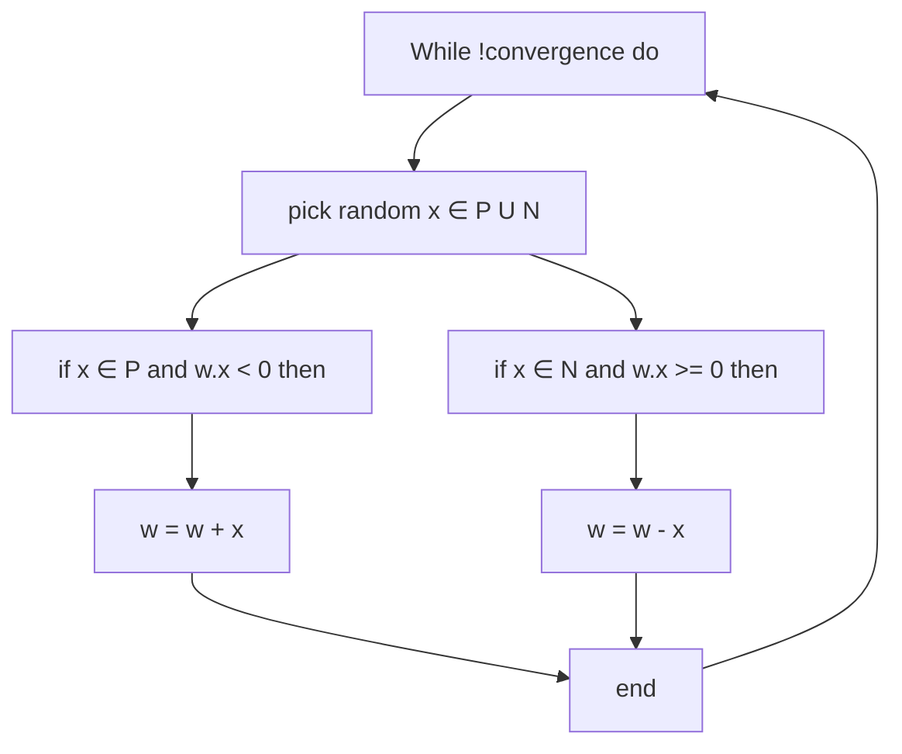

<hr/>

### ML vs DL

#### Machine learning

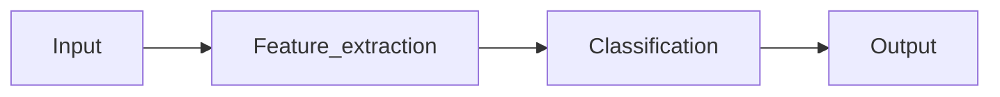

#### Deep learning

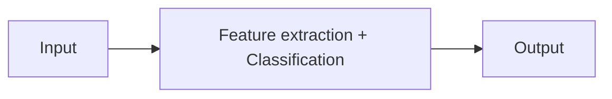
